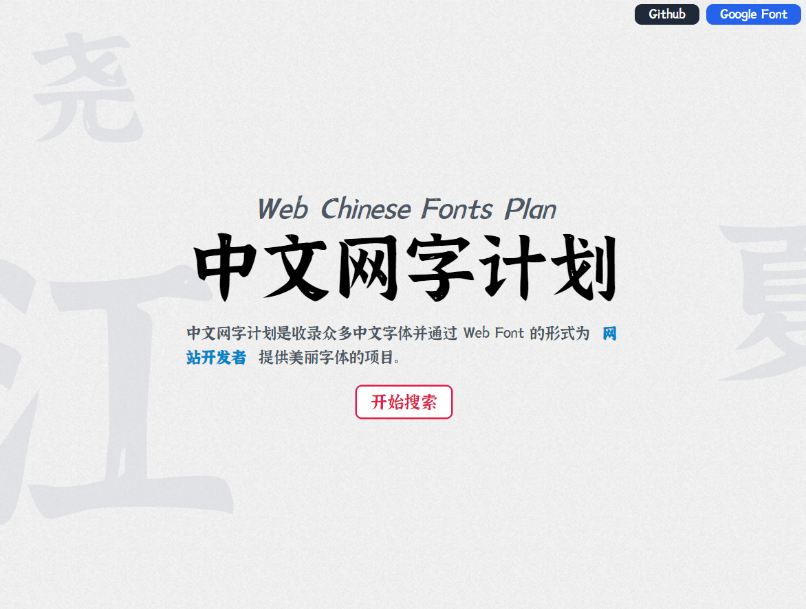
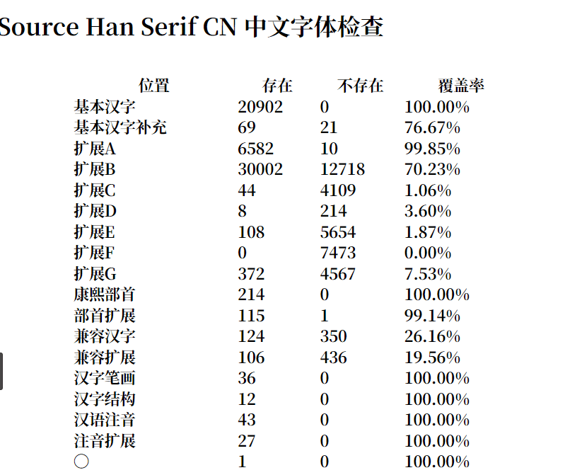
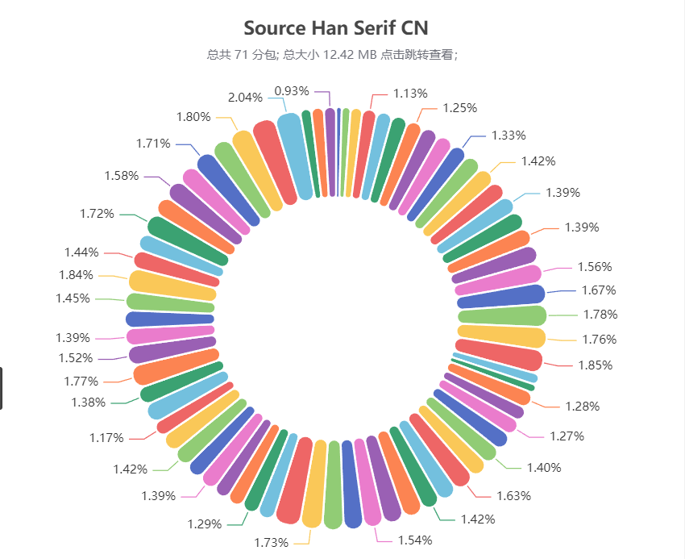
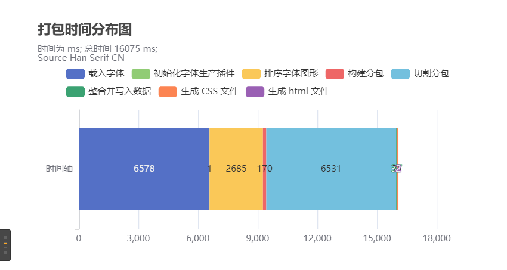
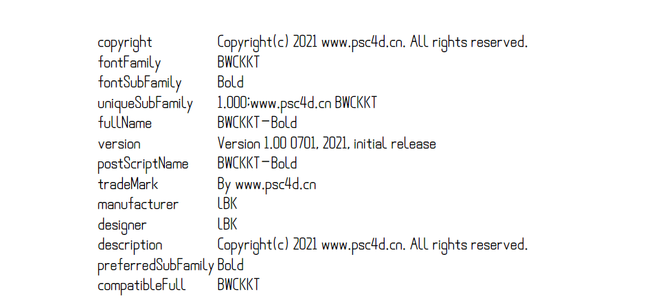

# 中文 Web Font 切割工具

| 更新时间： 2023/ 5 / 8 | 江夏尧 | Version 3.0.5 |

## 简介

在工作中遇到了使用中文字体的烦恼，字体包动不动就 10 多 MB，没有办法在 Web 应用中使用，所以制作了这个字体切割的插件。通过插件将大的字体文件切割为多个小的字体文件，然后通过 CSS 文件的 `unicode-range` 按需加载，实现整个字符集的可用加载！

### 新版本功能

1. ✅ 字体预览图生成

### 字符单个大小

不同于服务器加载 HTML 时抽取需要字符然后返回字符文件的操作，浏览器依据 CSS 中的 `unicode-range` 按需加载需要的字体文件，**每个文件只有 50 - 150 KB**，非常的快速简洁。

### 使用率的考量

我在考虑字符集的切割的时候，考虑了字符集中的字符的使用率不均匀的问题。

**字符集按照使用频率的高低进行分配位置。**

比如靠前的第一个字符分集中，都是使用率极高的字符，加载的可能性也更高，使用起来请求的时候方便缓存下来。

### 成品预览

成品可以查看我的字体库网站：

[字体库](https://chinese-font.netlify.app/#/home)



里面的字体都是可以免费商用的，我对其进行了切割并且放置在了 [Github](https://github.com/KonghaYao/chinese-free-web-font-storage) 和 [Gitee](https://gitee.com/dongzhongzhidong/chinese-free-web-font-storage) 上，如果需要可以直接获取文件。

## 快速使用

Nodejs 版本需要支持 es module，如果版本不够的话运行不了。

### 安装

```bash
npm install @konghayao/cn-font-split
```

### 写打包代码

```js
import { fontSplit } from "@konghayao/cn-font-split";

fontSplit({
    FontPath: "./fonts/SourceHanSerifCN-Bold.ttf",
    destFold: "./build",
    css: {
        // 覆盖默认的 css 设置
        // fontFamily: "站酷庆科黄油体",
        // fontWeight: 400,
    },
    targetType: "ttf", // ttf woff woff2；注意 eot 文件在浏览器中的支持度非常低，所以不进行支持
    // chunkSize: 200 * 1024, // 如果需要的话，自己定制吧
    testHTML: true, // 输出一份 html 报告文件
    reporter: true, // 输出 json 格式报告
    // previewImage: {}, // 只要填入 这个参数，就会进行图片预览文件生成
    // 注意： woff2 源文件生成预览图时，需要转化成 ttf，故会报告你没有安装一个依赖，npm 搜索并安装它即可
});
```

### 打包成品目录

```
- build
    ... // 很多字体分包
    - index.html // 用于展示打包分析报告
    - reporter.json // 打包信息
    - result.css // css 入口，引入这个 css 文件即可使用字体包
```

### 打包分析报告成果

1. 汉字囊括分析
   
2. 打包切片密集度分析
   
3. 打包时间分析
   
4. 字体头部信息展示
   
5. 全字体展示
   

## 已经知道的 BUG

1. 部分 otf 读取失败，这个可能是 otf 文件的问题
2. eot 文件在浏览器中的支持度非常低，所以没有必要使用这种字体格式作为目标格式
3. 3.0.4 及以下版本打包结果缺失非常重要的字体配置文件！
4. 有些字体本身对于中文符号没有设置全角大小，导致文本符号紧凑，这个是切割插件没法修补的。

## 提高你的字体加载速度

1. **切割分包大小适当**：我的建议是设置 50-100KB 左右范围进行打包，这样单个包的大小不会太大，HTTP2 的加载速度也够快。
2. **需要同步加载的字体包太多了**： 这个是因为你的服务器不支持太多的并发数。比如 JSDelivr、ESM.sh 等公益 CDN 都进行了并发数限制，一旦你的网站一次性加载字体包太多就中断 CDN。后面我使用了 Netlify 进行部署，速度是瞬间加载！
3. **字体文件下载抢占 JS 请求问题**：字体文件如果在入口 HTML 文件中加载，那么浏览器会查看 HTML 中需要使用的字，并加载字体，但是在 JS 中使用数据请求就会出现问题。已经发出的字体下载占用了浏览器的下载并发数，进而推迟 JS 下载。我的建议是使用 JS 添加 link 标签动态导入 css 的方式延迟大概 150ms 即可。
4. **一定要配置 HTTP 缓存**：在有缓存时，用户打开你的网站是可以达到 50ms 内瞬间加载完所有字体包的。由于字体文件配置一次就基本上不会进行改动，所以可以持久缓存。
5. **文档站点的预加载**：如果网站有条件，可以在首页或者是所有页面，在浏览器空闲的时候，使用 js 的 fetch （force-cache） 请求所有的字体包。这样浏览器会把字体都加入进缓存中，从而保证其它页面的文字也能迅速加载。至于分包的具体名称，可以使用 reporter.json 文件查看。

## 开源许可证

2.0.5 及以后 Apache-2.0

2.0.4 版本以前 MIT License
