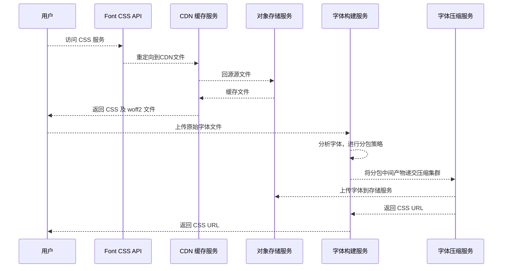

# Edge Font

## 整体架构

整体架构采用 Javascript 分布式边缘计算架构

核心逻辑如下图所示：

1. Font CSS API 是整个系统的网关服务，对外提供 URL 重定向。
    1. 服务部署为 JS 边缘函数
    2. 边缘函数响应快，查询 KV 也快，直接一个生态返回重定向 URL
2. 字体构建服务, 用于接收上传字体，和构建字体的 ttf 版本，性能消耗不大
    1. 单独部署为 JS 边缘函数，独写分离
    2. 构建字体时需要调用 harfbuzz 的库进行构建，时间略长
3. 字体压缩服务，提供 Woff2 字体压缩服务，需要高性能高并发，且网络够快
    1. 此项目采用了 Rust 构建服务器部署，速度比 WASM 版本要快非常多
    2. 我们也有 JS 版本的 Woff2 服务，但是速度太慢，弃用
