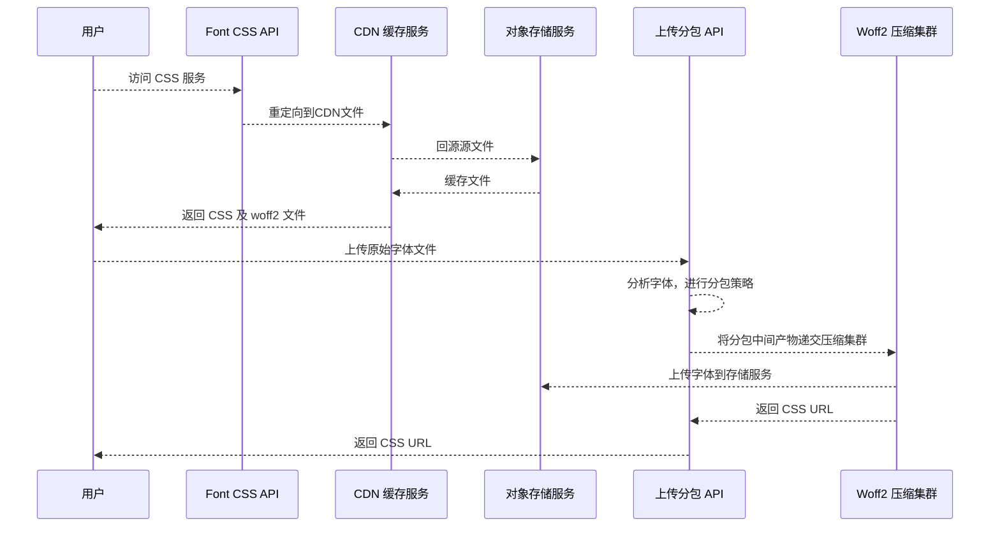

# Edge Font

## 整体架构

整体架构采用 Javascript 分布式边缘计算架构

核心逻辑如下图所示：

```mermaid
sequenceDiagram
    participant U as 用户
    participant F as Font CSS API
    participant CDN as CDN 缓存服务
    participant OSS as 对象存储服务
    participant Upload as 上传分包 API
    participant W as Woff2 压缩集群

    U -->> F: 访问 CSS 服务
    F -->> CDN: 重定向到CDN文件
    CDN -->> OSS: 回源源文件
    OSS -->> CDN: 缓存文件
    CDN -->> U: 返回 CSS 及 woff2 文件


    U -->> Upload: 上传原始字体文件
    Upload -->> Upload: 分析字体，进行分包策略
    Upload -->> W: 将分包中间产物递交压缩集群
    W -->> OSS: 上传字体到存储服务
    W -->> Upload: 返回 CSS URL
    Upload -->> U: 返回 CSS URL
```
